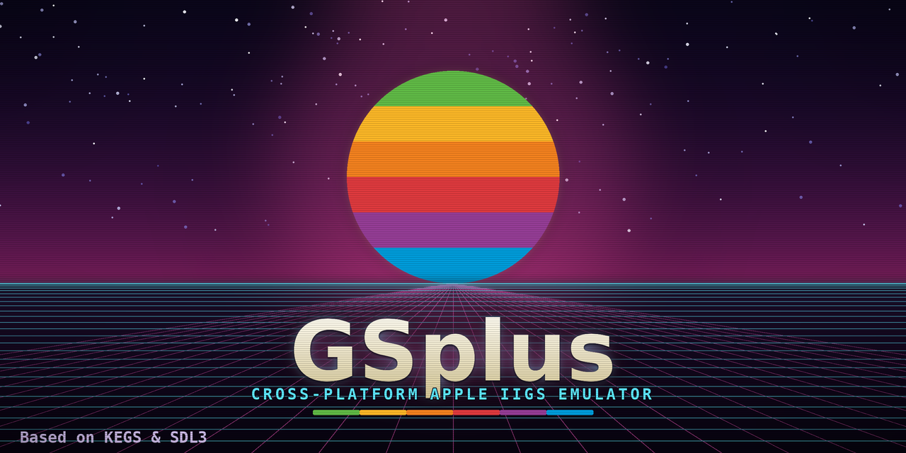
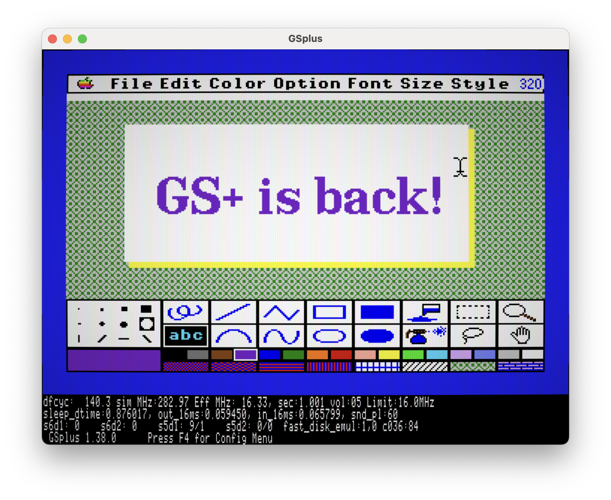

# GSplus

An accessible, cross-platform build of [KEGS](http://kegs.sourceforge.net) - 
Kent Dickey's Apple IIgs emulator - packaged with
[SDL3](https://www.libsdl.org/) for macOS, Linux, and Windows.

## What it is

GSplus wraps the KEGS core in a single SDL3 application that builds and runs the
same way on macOS, Linux, and Windows. It is **focused on the SDL3 build** - if
you want the native macOS or Windows versions, use
[KEGS](http://kegs.sourceforge.net) directly. GSplus tracks the KEGS version it's
based on (currently 1.38).

<a href="gsplus-screenshot-mac.png">
  
</a>

## You'll need a ROM

Like any IIgs emulator, GSplus needs an Apple IIgs ROM file to boot. Without one
it starts into a configuration screen with nothing to run.

## Downloads

Prebuilt apps are attached to each [release](../../releases). The builds aren't
code-signed yet, so your OS may warn that the app is from an unidentified
developer the first time you run it. This is expected:

**Windows** - SmartScreen blocks unsigned downloads. Click **More info → Run
anyway**. If the `.exe` won't start after unzipping, right-click it →
**Properties** → tick **Unblock** → **OK**. Keep `SDL3.dll` next to the `.exe`.

**macOS** - the app is only ad-hoc signed, so Gatekeeper flags it. Right-click
the app → **Open**, then confirm **Open**. If macOS still refuses, run
`xattr -dr com.apple.quarantine /Applications/GSplus.app`.

**Linux** - the `.tar.gz` relies on a system SDL3 (`libsdl3` from your package
manager). A self-contained AppImage is planned.

## Status

This is an early reboot - expect rough edges. SDL3 **video, input, and audio**
are working on macOS, Linux, and Windows.

### What's been added in GSplus

Everything below is part of the SDL3 build and isn't in stock KEGS:

- **Window & display options** - `-fullscreen`, `-borderless`, `-noaspect`,
  , plus window position; F11 toggles fullscreen.
- **Screenshot capture** - Shift+F12 grabs the framebuffer.
- **Gamepad support** - cross-platform SDL_Gamepad mapped to the IIgs joystick.
- **Terminal debugger** - a REPL for the built-in 65816 debugger from the
  controlling terminal.
- **Drag-and-drop disk loading** - drop a disk image on the window and GSplus
  guesses the slot from its size.
- **CRT scanline simulator** - `-scanline <0-100>`, Shift+F11 to toggle.
- **Curved CRT effect** - `-crt 1` with `-crtcurve` / `-crtmask`, Ctrl+F11 to
  toggle. Screen curvature, RGB phosphor mask, bloom, and vignette; composes
  with the scanline simulator.
- **One cross-platform build** - the same SDL3 app and CMake build on macOS,
  Linux, and Windows, with prebuilt downloads for each.

## Building from source

GSplus builds with CMake (Ninja generator). SDL3 is used if installed, otherwise
built from source automatically. From the repository root:

```sh
cmake -G Ninja -B build -S gsplus/src
cmake --build build --target gsplus-sdl
```

This produces the GSplus app:

- **macOS:** `build/GSplus.app`
- **Linux:** `build/gsplus`
- **Windows:** `build/gsplus.exe` (with `SDL3.dll` alongside)

### Dependencies

**macOS** (Homebrew, plus the Xcode Command Line Tools):

```sh
brew install cmake ninja sdl3
```

**Linux** (Debian/Ubuntu) - the X11/Wayland/audio packages are SDL3's build
dependencies:

```sh
sudo apt install cmake ninja-build build-essential git \
  libx11-dev libxext-dev libxrandr-dev libxcursor-dev libxi-dev \
  libxfixes-dev libxss-dev libxtst-dev libxinerama-dev \
  libwayland-dev wayland-protocols libdecor-0-dev libxkbcommon-dev \
  libdrm-dev libgbm-dev libegl1-mesa-dev libgl1-mesa-dev libgles2-mesa-dev \
  libpulse-dev libasound2-dev libpipewire-0.3-dev libsndio-dev \
  libdbus-1-dev libudev-dev libibus-1.0-dev
```

**Windows** ([MSYS2](https://www.msys2.org/), in the MINGW64 shell):

```sh
pacman -S git mingw-w64-x86_64-gcc mingw-w64-x86_64-cmake mingw-w64-x86_64-ninja
```

## About Branches

- KEGS latest is tracked in the `./upstream` directory.
- An `upstream` branch is updated whenever there's a new KEGS version and merged
  to `main`.
- This makes it easy to track KEGS changes somewhat independently of the GSplus
  work.

## A note from Dagen

I've tried to reboot GSplus more than once over the past few years and each time 
I'd sink weeks into build and packaging a new release, and then life would pull 
me away for months, sometimes years, and momentum would die. This project does 
leverage AI to allow me to provide some form of the emulator offering made when 
I had time to write it 100% myself.

KEGS is a brilliant piece of pure C, and is living proof that you don't need
AI to write great software. Kent Dickey did the hard, beautiful work. The AI 
here is just a pragmatic crutch to keep *my* reboot alive between the demands 
of real life.

So what does GSplus actually add? Two honest things: **accessible, prebuilt
packages** so anyone can download and run an Apple IIgs without compiling
anything, and a handful of **features I want for myself**. If you want the
canonical emulator, go straight to KEGS.  It's great!

- Dagen
